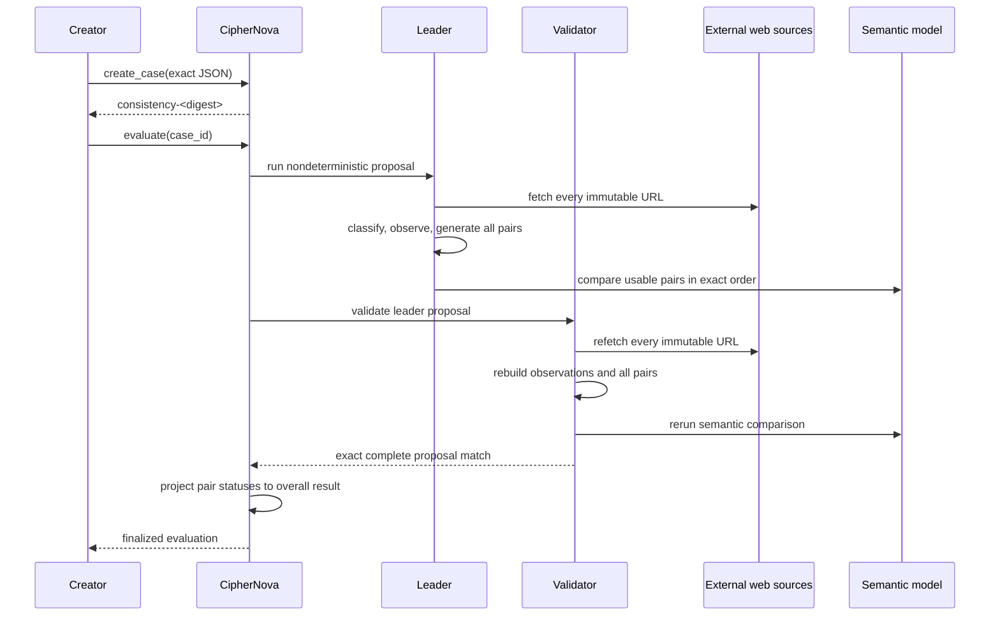

# CipherNova v1 architecture

CipherNova owns one narrow state transition: it records an immutable bounded set of external records and, after independent GenLayer evaluation, records whether every unique record pair is semantically consistent, conflicting, or unresolved. It does not decide which record is correct.

## Boundary

The application constructs the case and chooses records intended to describe one underlying fact. The external URLs own the raw documents. GenLayer owns immutable case binding, secure fetch classification, pair generation, semantic pair judgments, validator equivalence, retry state, and the deterministic overall projection. A consuming application owns authentication, indexing, previews, and any downstream action.

The primitive is not a quorum, majority, source-authority, debate, dispute, rubric, eligibility, SLA, ranking, scoring, or winner-selection contract.

## Immutable case

`create_case(case_json)` strictly parses one JSON object with the exact keys `schema_version`, `title`, `subject`, `consistency_claim`, and `records`. Every record must have exactly `record_id`, `label`, and `source_url`. Duplicate JSON keys are rejected recursively. Record order is preserved. The sender is read from `gl.message.sender_address`; a caller-supplied creator is not accepted.

The normalized case definition is hashed before metadata is attached:

```text
case_digest = SHA256(UTF8("CipherNova/v1/case/" + canonical_definition))
```

The case ID is `consistency-` followed by a lower-case 64-hex SHA-256 digest over the monotonic global case counter, sender-derived creator, transaction timestamp, and case digest. The stored case then contains the definition plus `case_id`, `creator`, `created_at`, and `case_digest`.

## Storage

The contract uses only these persisted fields:

```text
case_records:          TreeMap[str, str]
evaluation_records:    TreeMap[str, str]
creator_case_count:    TreeMap[str, u256]
creator_case_id:       TreeMap[str, str]
case_count:            u256
```

The first two maps contain canonical JSON strings. At most five records and ten pair findings are involved in a case. Raw fetched evidence remains in the nondeterministic execution frame and is represented in final state only by observations and content digests.

## Data flow



Each validator independently repeats every consequential nondeterministic step. The validator does not consume leader source text, observations, semantic output, or reasoning.

## URL and media security

Accepted URLs are HTTPS-only, credential-free, query-free, fragment-free, port-free, ASCII-hosted URLs with one of five static textual suffixes: `.json`, `.jsonld`, `.xml`, `.txt`, or `.md`. Hosts are lowercased and trailing dots are removed. Local/internal suffixes, localhost, raw IP literals, decimal/hex numeric host tricks, Unicode/IDN, malformed percent escapes, backslashes, unsafe path characters, and unsafe authorities are rejected. Decoded path dot segments are normalized before the suffix check.

Accepted media are `text/plain`, `text/markdown`, `application/json`, `application/ld+json`, `application/xml`, `text/xml`, and safe application subtypes ending in `+json` or `+xml`. SVG is rejected explicitly by the top-level application restriction. Images, PDF, HTML, arbitrary binary, browser rendering, and code execution are outside v1.

## Fetch observations

Every source produces one ordered observation:

```json
{
  "record_id": "docs",
  "record_index": 0,
  "url": "https://docs.example/fee.json",
  "status_class": "OK",
  "available": true,
  "media_accepted": true,
  "redirect_blocked": false,
  "content_digest": "<64 lowercase hex characters>"
}
```

Text is decoded as strict UTF-8 and normalized with `" ".join(decoded.split())`. This collapses whitespace and is not lossless. Usable content is bounded at 2,000 UTF-8 bytes after normalization; raw response bytes are bounded at 120,000.

Transient classes are `TRANSIENT_408`, `TRANSIENT_425`, `TRANSIENT_429`, `TRANSIENT_5XX`, and `TRANSIENT_PROVIDER`. One transient observation makes the entire proposal `RETRYABLE_FAILURE`, with no semantic comparisons or overall result. Redirects and all other terminal unusable responses are not conflicts. A pair with either unavailable member is deterministically `UNRESOLVED`.

## Pair generation and semantic evaluation

The stored array order drives a deterministic nested-loop generator:

```text
for left in records:
    for right after left in records:
        emit(left.record_id, right.record_id)
```

For five records this emits exactly A–B, A–C, A–D, A–E, B–C, B–D, B–E, C–D, C–E, D–E. No self-pairs, reverse pairs, duplicate pairs, or model-selected order are possible.

Only pairs whose two records are usable enter one strict semantic prompt. The context contains the title, subject, claim, usable records in case order, source URLs, normalized usable text, and the exact semantic pair descriptors. It is checked against `MAX_CONTEXT = 48,000` bytes. The prompt is checked against `MAX_PROMPT = 56,000` bytes.

The model must return only:

```json
{
  "comparisons": [
    {
      "left_record_id": "docs",
      "right_record_id": "config",
      "status": "CONSISTENT"
    }
  ]
}
```

The strict parser rejects duplicate keys, wrong top-level fields, missing/extra/reversed/reordered/duplicate pairs, wrong IDs, invalid statuses, explanations, confidence, rationale, and any overall result. The contract merges model statuses with deterministic `UNRESOLVED` values for unavailable-member pairs into the complete canonical pair list.

## Consensus and Equivalence Principle

`gl.vm.run_nondet_unsafe` wraps a leader function and a validator function. Both invoke the same module-level independent proposal builder, but execution is separate. The leader:

1. loads the immutable case snapshot;
2. fetches all URLs;
3. creates ordered observations and detects transient state;
4. generates the complete pair set;
5. builds bounded semantic context;
6. reruns semantic evaluation for every usable pair;
7. parses and merges exact canonical comparisons; and
8. returns the complete proposal.

The validator independently performs the same eight operations and compares its expected proposal to the leader proposal by exact structural equality. Before comparison, proposal validation binds case ID/digest, every observation field and order, observation digest, state, every pair field and order, and every pair status. This is not a format-only validator: it independently refetches and re-evaluates the evidence.

## Deterministic projection

The model never emits the overall result. Once a finalized complete comparison list is validated, deterministic contract code applies:

```text
any CONFLICT       -> INCONSISTENT
else any UNRESOLVED -> UNRESOLVED
else                -> CONSISTENT
```

The 100/100/200 example therefore produces one consistent pair, two conflict pairs, and `INCONSISTENT`; no majority value is stored. Four consistent pairs plus one conflicting pair likewise remains `INCONSISTENT`.

## Retry and finality

An initial attempt has `retry_count = 0`. A transient proposal stores only state, case binding, retry count, source observations, and observation digest. It does not store semantic comparisons or a result. Retry attempts increment the count and may produce another retryable proposal or a final result. Finalized evaluations contain complete comparisons, deterministic result, evaluation digest, result digest, and `finalized_at`. Neither case nor final evaluation can be edited, cancelled, or re-evaluated.

## Digest domains

Canonical JSON uses sorted keys, compact separators, `ensure_ascii=False`, UTF-8, and SHA-256. The namespace is `CipherNova/v1/`. The implementation uses these domains:

- `case`: normalized immutable definition;
- `case-id`: counter, creator, timestamp, and case digest;
- `source-content`: normalized usable source text;
- `source-observations`: ordered compact observation list;
- `semantic-comparisons`: case binding, observation digest, and complete comparisons;
- `final-result`: normalized immutable case, case binding, observations, comparisons, and projected result.

## Context proof

The maximum-value regression fixture uses five valid 2,048-byte normalized URLs, five 2,000-byte normalized contents made from JSON-escapable quote/backslash characters, maximum title/subject/claim/label values, and all ten pair descriptors. The measured canonical context is 39,761 bytes and the complete prompt is 41,200 bytes. Both are below their configured limits with material margin. Creation rejects over-bound public inputs before immutable state is written.

## Runtime limitations

Semantic judgments are model-mediated, not formal proof. External source availability and content can vary. Normalization loses formatting information. The web runtime's redirect and DNS behavior remains environment-dependent. The contract does not support source updates, PDFs, images, HTML rendering, JavaScript, video, arbitrary binary, authority ranking, source quorum, truth selection, scoring, or downstream actions.
